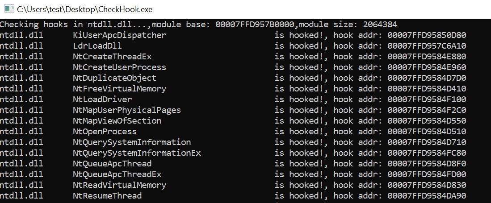

# CheckHook

English | [中文](README_zh.md)

A security analysis tool for detecting Windows Dynamic Link Library (DLL) function hooks. This tool can scan loaded modules and detect whether functions have been hooked by EDR systems.

## Overview

CheckHook is a lightweight Windows security tool for detecting whether critical DLL functions in the system have been hooked.

## Usage
Build the project and double-click to run.

## Principle

CheckHook traverses all loaded DLL modules by accessing the process PEB (Process Environment Block) structure, parses the PE format export table of each module to obtain all exported function addresses, then checks whether the bytecode at the function entry point is a JMP instruction (0xE9). If the jump target exceeds the original module address range, it is determined to be hooked. This tool primarily detects simple hooks based on JMP instructions.

## Detected DLL List
The tool will detect the following critical system DLLs. You can add other DLLs as needed.
"ws2_32.dll", "wininet.dll", "winhttp.dll", "urlmon.dll", "iphlpapi.dll"
"advapi32.dll", "crypt32.dll", "bcrypt.dll", "cryptsvc.dll", "schannel.dll"
"psapi.dll", "netapi32.dll", "srvcli.dll", "sechost.dll", "setupapi.dll"
"dbghelp.dll", "tlhelp32.dll"
"user32.dll", "gdi32.dll", "shell32.dll", "comctl32.dll"
"msvcrt.dll", "ucrtbase.dll", "msvcp140.dll"
"kernel32.dll", "ntdll.dll", "ole32.dll", "rpcrt4.dll"

## Screenshot

  

## License

This project is licensed under the MIT License. See the LICENSE file for details.

## Disclaimer

⚠️ **Important Notice**: 
- This tool is intended for educational and legitimate security research purposes only
- Do not use for malicious purposes or on unauthorized systems
- Users assume all risks associated with using this tool
- The author is not responsible for any damages caused by the use of this tool

---

**Note**: This tool has been tested on Windows 10/11 x64 systems. Compatibility with other system versions is not guaranteed.